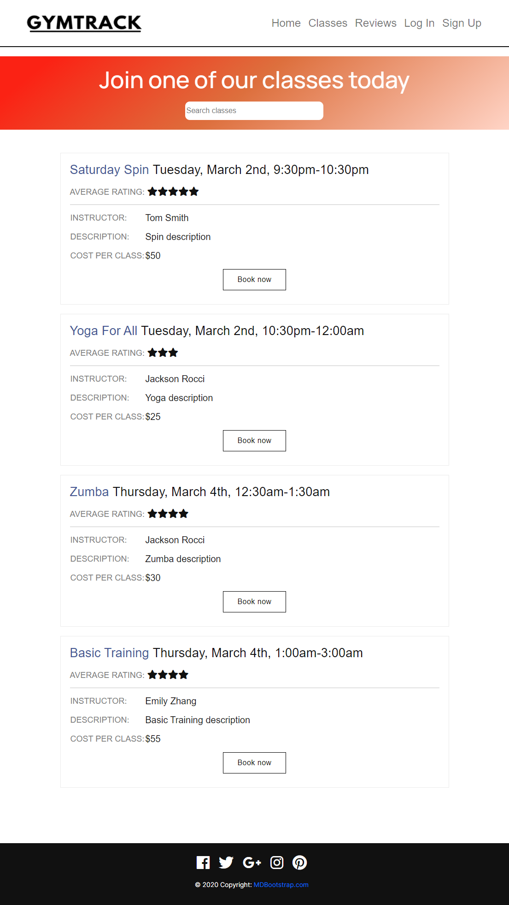
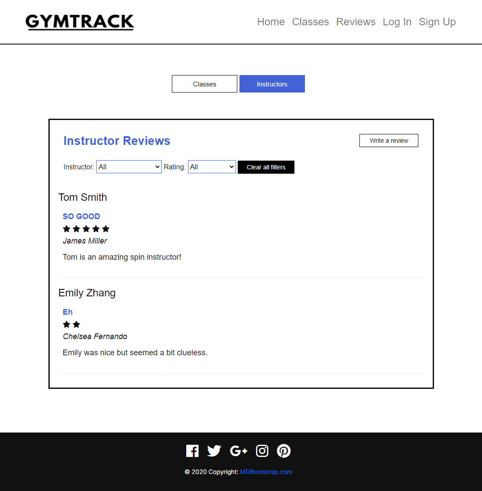
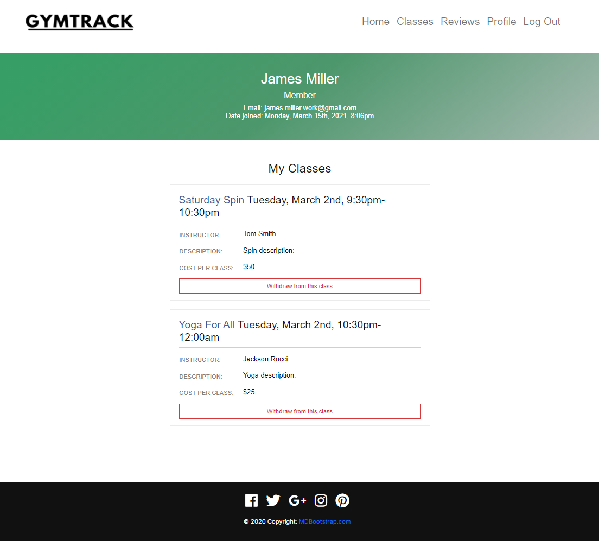

# Gymtrack

## Description 

*Gymtrack* is an application that provides gym owners with a system to manage data related to instructors, members, classes, and reviews left by members.

There are two types of application users: *instructors* and *members*. Instructors are able to log in and add/edit/delete classes. Members are able to log in and book classes as well as leave reviews about classes and/or class instructors.  

## Table of Contents 

- [Motivations](#Motivations)
- [Technologies Used](#Technologies-Used)
- [Testing](#Testing)
- [Links](#Links)
- [Screenshots](#Screenshots)
- [Contributors](#Contributors)
- [License](#License)

## Motivations 

We wanted to design a useful application that would facilitate the basic process of creating and booking classes at gyms, and to provide gym members with a platform on which to provide feedback.

As budding web developers, we also approached this project with the objective to build on our understanding of application architectures, in particular, through the implementation of the Model-View-Controller design pattern. 

## Technologies Used

- Node.js 
- Express / Express sessions 
- MySQL / Sequelize 
- Passport.js
- bcrypt
- Handlebars 
- CSS / Bootstrap
- Google Fonts
- Font Awesome 

## Testing 

You can test various application functionalities by logging in through one of the seed accounts provided in the source code:
1. Navigate to the the db/seeds.js file and use any one of the provided email and password credentials.
2. To log in as an instructor, use the email and password of one of the three instructor accounts listed under the "Instructor seeds" comment.
3. To log in as a member, use the email and password of any one of the four member accounts listed under the "Member seeds" comment. 
4. Anyone who signs up for an account through the signup page is a member. In the meantime, instructor accounts must be created through the backend. 

## Links 

- GitHub repository: [https://github.com/kvlin/gymtrack](https://github.com/kvlin/gymtrack)
- Deployed application: [https://gymtrack-kl.herokuapp.com/](https://gymtrack-kl.herokuapp.com/)
- Presentation slides: [Google Slides](https://docs.google.com/presentation/d/1Fq8ysZkSJzhZkVIfUYoRk6_kMDduu-L-Hf_VRpZTnmg/edit?usp=sharing)

## Screenshots 

### Homepage

### Classes 

### Reviews

### Profile page 

#### Member  

#### Instructor 

## Contributers 

- [Kevin Lin](https://github.com/klin4994)
- [Jessica Hong](https://github.com/jkaho)
- [Tomomi Inoue](https://github.com/Chib1co)
- [Joshua Steward](https://github.com/JoshSteward)

## License 

This application is covered under the ISC license.
For more information, [click here](https://opensource.org/licenses/ISC).
